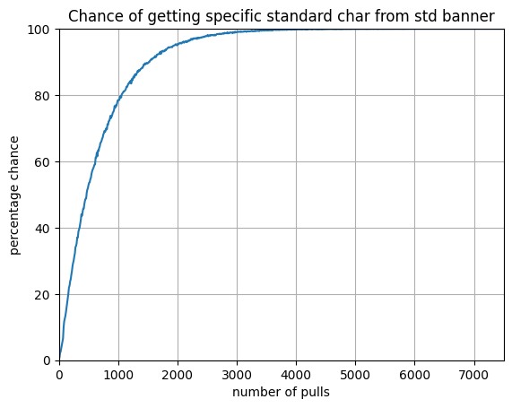

# Random Walk Wish Probability Calculations

## Inspiration

I have a friend who was addicted to the game and spent way more money then he should on it, so I made it a weekend project to research and calculate the true probabilities they were gambling on as a sort of intervention through information. I am making these calculations public to help others be more informed about the predatory model of the game.

## What it is
This is a random walk simulation to calculate the probability of getting specific standard five star characters in the game Genshin Impact. 

## Results of calculations
In Genshin version 3.6, there will be a total of 7 standard 5 star characters. The chance to get one of them given a number of pulls on the character banner can be seen in these two graphs:

By the time people get to even just a 60% chance to get a specific standard banner character, there will likely be an even higher number of standard 5 star characters. The following two graphs are calculations in the hypothetical situation that the number of standard five stars increases by 2 to 9.

The next two graphs are the chances of getting a specific standard character from the 3.6 standard banner given a number of pulls. Note that the range on the y-axis is [0,100] in this zoomed in version, but was [0,50] in the previous two zoomed in graphs.

I've also made a table to show some key probabilities. The values are the number of pulls it takes for the probabilities in the first column. All number of pulls are rounded to the nearest ten.

## Calculation methodology
I researched the probabilities of the various predatory mechanics and how they worked, and then made a simulation based on that.

Probabilities for the simulation come from the website <a href="https://paimon.moe/wish/tally">paimon.moe</a> as its empirical data shows that the chance of pulling a five star is not even. I would like to credit jogerj#8222 for help with the website's api.

 The simulation was run with number of pulls in the range from 0 to 7500 with gaps of 10 pulls (So results are rounded to the nearest ten). At each pull level it was run at, it was run with 16,000 trials which were then averaged. The number of trials was chosen by minimizing std while also making sure it doesn't run for too long (I timed it to run overnight while I sleep). 16000 results in a standard deviation of 0.102 at 6000 pulls (high end of the range) and 0.168 at 100 pulls (low end of the range), so assuming a normal distribution, 97% of the probability values should be within around 0.204% to 0.336%.

## Future steps
Feel free to fork it, merge request whatever you want, make issues, etc. I'm not planning on updating it or changing anything as of now. As I mentioned, this was just meant to be a one time intervention for a friend. It wasn't initially designed to be maintained or updated.